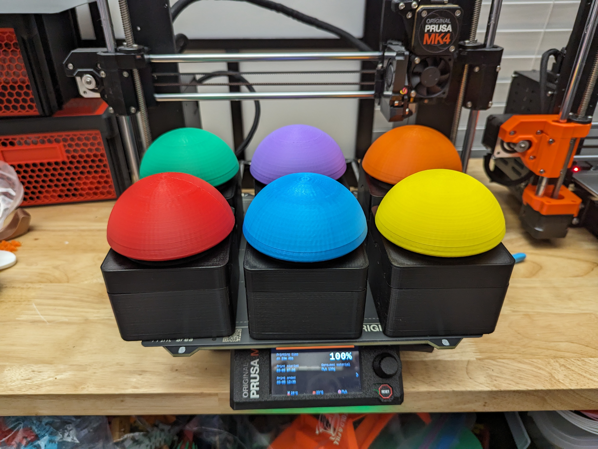

# Pop Poll

This is a really simple Svelte based project meant to satisfy a simple request from a friend. It started with a different name (also in github!) using a Bootstrap template, jQuery, and Chart.js. That was built in a few hours and since this was something that was going to be used once a year at a 2 hour event that should have been the end. But like every developer, I started daydreaming that this was my next million dollar idea.

# More Backstory

Here is how the conversation went:

Trish: "Hey Sheldon! I loved that button you made for your Hallowingo app. You think we could use buttons for a voting app on our Pi Day event?"

Me: (to myself) No way! The button connected to a web app and I just slightly modified that app and made it my own! There is no way something like this exists for me to "use".

Me: (to her) Maybe! Let me see if Bootstrap and jQuery are still around!

The basic prototype in jQuery worked great! But it had some shortcomings. For one, I had hard coded all the labels and text. The only real variable was an array of numbers that stored the number of votes. Every year the names would change! And what if someone else wanted to use this? And what if there were more or less participants? It was easy enough to edit the one main file and change that around and it even auto deployed to github pages so that was one option. If I wanted a regular user to be able to edit it, I would have to go further.

I looked into ways to iterate over div after div after div with jQuery but everything I looked at would require me to wrap all my html in quotes and just treat the html as strings and insert it into the DOM the old fashioned way. I was bumping up into the reasons why front end frameworks exist.

So I followed the "create-svelte-app" tutorial and here we are!

# Hosting

For now it's just hosted on github as a static page. I might get it a domain someday but I already have 50 unused domain names.

[Try it here](https://tooshel.github.io/poppoll/)

# Thanks!

Shout out to Drew [@aewing](https://github.com/aewing) who was always there to help with Svelte questions. He also submitted the first PR that helped me get a good understanding of how a Svelte Store worked and the app is way better thanks to him. It's also formatted correctly because he had prettier on which encouraged me to get it working.

Thanks to [Kelly deVos](https://twitter.com/KdeVosAuthor) for the name!

Thanks to [Trish]() for the idea!

# The buttons!!

The entire point of this app is to be a simple vote counter but it's best used with buttons!

I programmed an Arduino compatible board to act as a keyboard and just output a character when you press a button. You can also just press keys 1-9 on a keyboard to vote. But the buttons are way cooler. I wrote code for a Leonardo (which is a the classic Arduino board) and also for a Arduino Sense 33 and as you can see, the way you work with a keyboard depends on the board. The code for that is in this project in the [firmware folder](https://github.com/tooshel/poppoll/firmware).

# Storage

The votes are stored to localStorage and no where else. There is no server for this project and it's all just served up by a simple Github page. All your data is stored in localStorage and nowhere else.

# Local Dev

This is just a static svelte site so if you know svelte (or anything node/js based, you'll be able to figure it out) but here is a hint:

`clone the repo, run npm install`

Start the dev environment. Look at the help to see you can press o enter to open it in a web browser.

`npm run dev `

Use this to build the prod version

`npm run build`

# Deploy

Globally install the gh-pages package . . then

`npm run build`

Use this to deploy it as a github page to the gh-pages branch

`npm run deploy`
